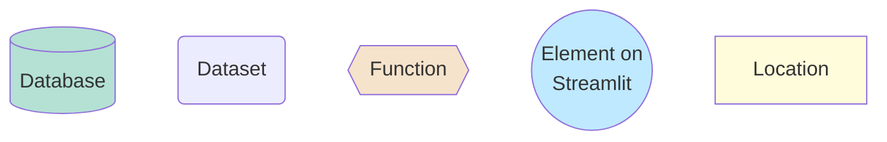
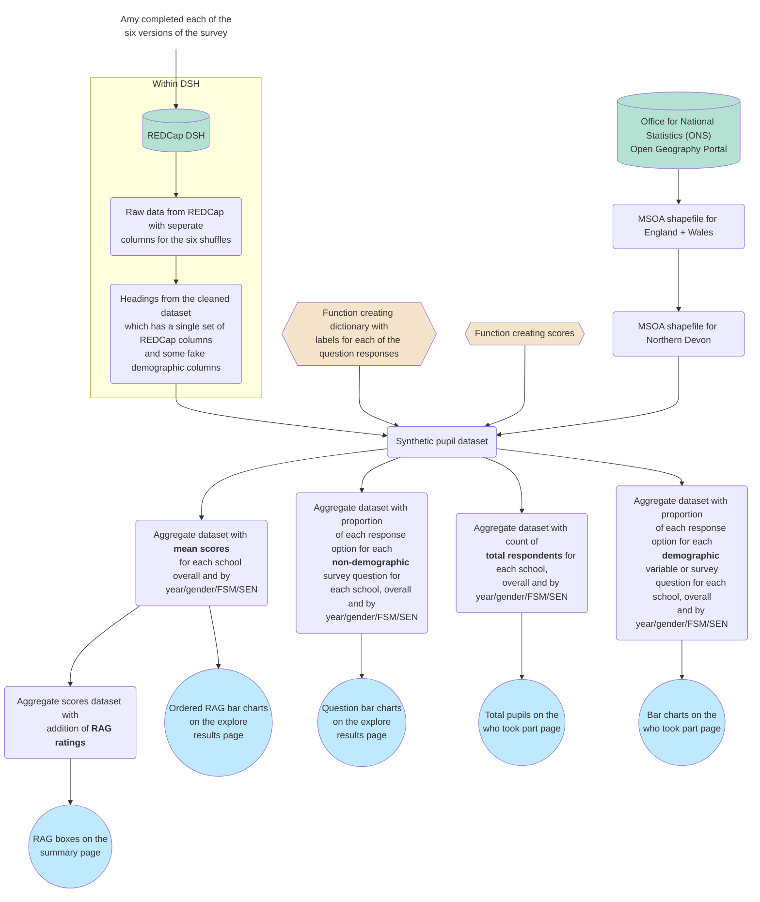

# Guide to processing steps used in creation of the synthetic standard survey school dashboard

Please note: This will differ for the symbol survey and public dashboards.

For a **preview of the data columns and types** at key stages in this process, please see `data_structures.ipynb`.

## Data processing for the synthetic dashboard

### Key:

### Figure:

### Description:

#### Cleaning the REDCap data extract

Pupil survey responses are stored within REDCap on the Data Safe Haven (DSH). Pupils were assigned to one of six survey orders, to mitigate the impact of response fatigue. For example, for a question on acceptance by peers, there will be seven sets of columns - one from the default survey set up ('accept_peer_shuffle') and then six for each of the shuffles ('accept_peer_shuffle_1', 'accept_peer_shuffle_2', ''accept_peer_shuffle_3', 'accept_peer_shuffle_4', 'accept_peer_shuffle_5', and 'accept_peer_shuffle_6'). All the data can be downloaded as a single extract using the "Data Exports, Reports, and Stats" page on REDCap.

Cleaning is performed using the script `clean_standard_survey_1.ipynb` on the DSH under Group(S:)/ Kailo_Consortium_BeeWell/ scripts/. This script creates a single set of columns (rather than six columns for the same question). It also adds some synthetic demographic data columns (to mimic data that would be received from the council).

#### Creating the synthetic dataset
The synthetic pupil dataset is produced through:
* Extracting the headings from the cleaned REDCap dataset
* Populating each of those columns by sampling from the numeric response options in the dictionary of labels (for each question, there is a dictionary with all possible numeric responses from REDCap and the relevant labels)
* Adding an MSOA for each pupil by randomly sampling from the list of MSOA in Northern Devon (as extracted from the ONS shapefile)
* Adding some random missing data for all variables except school
* Adding some intentional missing data (e.g. school missing a whole year group)
* Adding scores for each pupil on each topic
* Adding labels for each of the responses

#### Producing aggregated datasets for use in Streamlit

Five datasets are produced for use in streamlit.

1. **Aggregate scores and RAG** - Provides the mean score (and count of pupils it was based on) for each question by school and the chosen pupil characteristics (gender, year group, FSM and SEN). The RAG ratings are calculated by finding the overall mean score for a question across all schools using a weighted mean (weighting mean of each school by school size - using this approach so would be consistent with how would calculate for GM data where wouldn't have pupil level). The weighted standard deviation is also calculated. Whether someone is then above average, average or below average is based on whether they are within 1 standard deviation of the mean. Variable labels and descriptions and descriptions are also added for use on the Streamlit page.
2. **Aggregate non-demographic responses** - provides the proportion of people giving each possible response to each question. In order to ensure one row per question, these are stored as lists within a single cell of the dataframe (see head of dataframe below for example). Labels for each response option are included, as well as an overall label for the question to use on the streamlit page. Results are provided for each school and by the chosen characteristics.
3. **Overall counts** - this dataset provides the overall count of pupils who answered at least one question (and were therefore included in the dashboard) for each school and by the chosen characteristics.
4. **Aggregate demographic responses** - this is as calculated for the non-demographic, except that they are only provided by school and not by pupil characteristics, and there are different rules for censoring small sample sizes.

## Data processing that will be required for the actual dashboards

Differences (beyond the obvious, of not creating synthetic data) will include:
* **Demographic data** will be provided by Devon County Council. It will be linked to the survey responses based on the pseudonymised UPN associated with each of the survey responses. It will likely have different column names and response options, compared to what I have used.
* **Location of processing** will need to be entirely within the DSH. This was not done for the synthetic dashboard as it is using synthetic data, so storing the scripts outside of the DSH allows us to have a trackable and forever accessible record in GitHub of how data were processed.
* **Pupil MSOA** will need to be identified using their postcode and the lookup file (although this is only relevant to the public dashboard)
* **Gender** will need to be chosen from either the survey response for gender, council data on gender, or a combination of both.
* **Cleaning** will need review to check for any additional cleaning steps required on the actual data