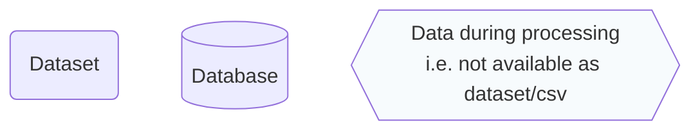
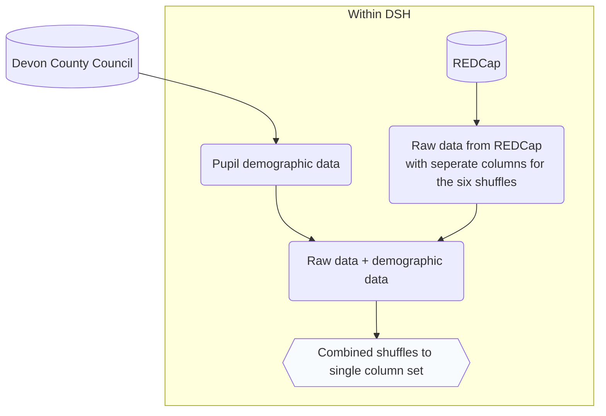

# Data structures guide for the standard survey school dashboard

Please note: This will differ for the symbol survey and public dashboards.

## Data processing summary

### Key:

### Figure:

### Description:

**REDCap data extract:** Pupil survey responses are stored within REDCap on the Data Safe Haven (DSH). Pupils were assigned to one of six survey orders, to mitigate the impact of response fatigue. These orders were structured to start and end with a section that was relatively easy/light-hearted to answer, and the remainder of the sections were shuffled randomly. All the data can be downloaded as a single extract using the "Data Exports, Reports, and Stats" page on REDCap.

**Combining survey responses:**

**File locations:** Currently, the files for performing the processing steps above are:
* Combining survey responses - `clean_standard_survey.ipynb` on DSH under Group(S:)/Kailo_Consortium_BeeWell/scripts/
* TBC

This will need to change when moving from synthetic to real data, as TBC.

## Data fields and types at key stages

### Raw data

### After processing

### For dashboard

### For figure