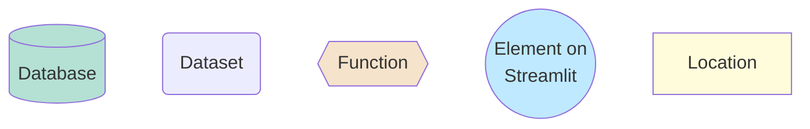
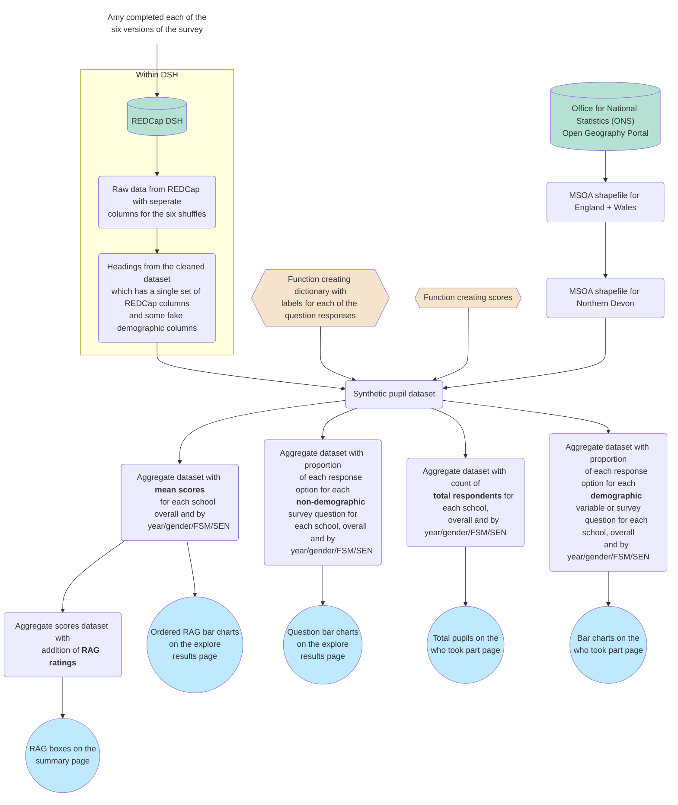

# Data structures guide for the synthetic standard survey school dashboard

Please note: This will differ for the symbol survey and public dashboards.

## Data processing for the synthetic dashboard

### Key:

### Figure:

### Description:

#### Cleaning the REDCap data extract

Pupil survey responses are stored within REDCap on the Data Safe Haven (DSH). Pupils were assigned to one of six survey orders, to mitigate the impact of response fatigue. For example, for a question on acceptance by peers, there will be seven sets of columns - one from the default survey set up ('accept_peer_shuffle') and then six for each of the shuffles ('accept_peer_shuffle_1', 'accept_peer_shuffle_2', ''accept_peer_shuffle_3', 'accept_peer_shuffle_4', 'accept_peer_shuffle_5', and 'accept_peer_shuffle_6'). All the data can be downloaded as a single extract using the "Data Exports, Reports, and Stats" page on REDCap.

Cleaning is performed using the script `clean_standard_survey.ipynb` on the DSH under Group(S:)/ Kailo_Consortium_BeeWell/ scripts/. This will:
* Create a single set of columns (rather than six columns for the same question)
* Drop pupils if all responses were blank
* Convert answers to numeric (as REDCap answers are numbers but need to change from formatting as strings, '0', '1', etc)
* Set the places and barriers question to NaN if none of the options were chosen (as it was a 'select all that apply' question so requires seperate cleaning based on whether all responses were 0)
* Calculating scores to represent each of the topics in the survey
* Adding label columns for each of the variables in the dataset (so e.g. can translate 0 1 2 to 'Always', 'Sometimes', 'Never')

#### Creating the synthetic dataset
The synthetic pupil dataset is produced through:
* Extracting the headings from the cleaned REDCap dataset
* Populating each of those columns by sampling from the numeric response options in the dictionary of labels (for each question, there is a dictionary with all possible numeric responses from REDCap and the relevant labels)
* Adding an MSOA for each pupil by randomly sampling from the list of MSOA in Northern Devon (as extracted from the ONS shapefile)
* Adding some random missing data for all variables except school
* Adding some intentional missing data (e.g. school missing a whole year group)
* Adding scores for each pupil on each topic
* Adding labels for each of the responses

#### Producing aggregated datasets for use in Streamlit

<mark>need to write</mark>

## Data processing that will be required for the actual dashboards

Differences (beyond the obvious, of not creating synthetic data) will include:
* **Demographic data** will be provided by Devon County Council. It will be linked to the survey responses based on the pseudonymised UPN associated with each of the survey responses. It will likely have different column names and response options, compared to what I have used.
* **Location** of processing will need to be entirely within the DSH. This was not done for the synthetic dashboard as it is using synthetic data, so storing the scripts outside of the DSH allows us to have a trackable and forever accessible record in GitHub of how data were processed.
* **Gender** will need to be chosen from either the survey response for gender, council data on gender, or a combination of both.
* **Cleaning** will need review to check for any additional cleaning steps required on the actual data

## Data fields and types at key stages

### Raw data

<mark>need to save copies of raw data in github and pull from them</mark>

### After processing

### For dashboard

### For figure