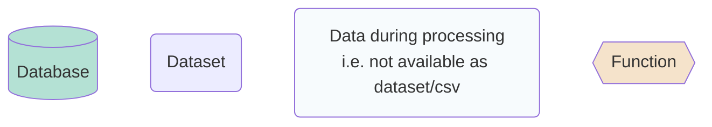
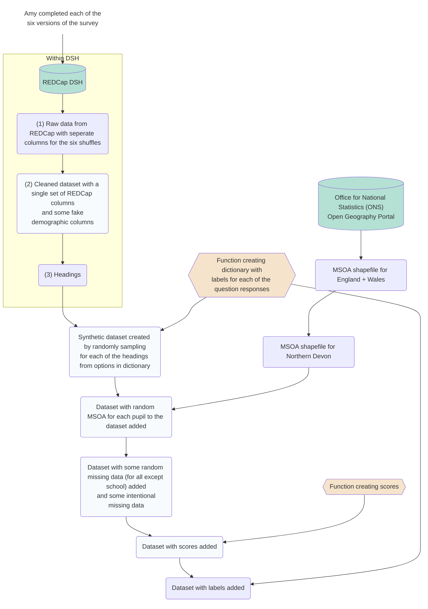
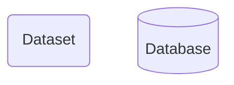
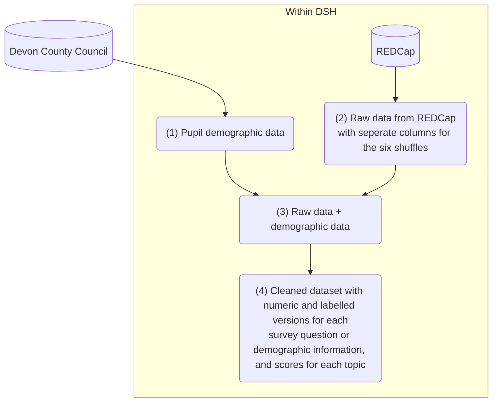

# Data structures guide for the synthetic standard survey school dashboard

Please note: This will differ for the actual standard survey dashboard, and for the symbol survey and public dashboards.

## Data processing for the synthetic dashboard

### Key:

### Figure:

### Description:

**(1) REDCap data extract:** Pupil survey responses are stored within REDCap on the Data Safe Haven (DSH). Pupils were assigned to one of six survey orders, to mitigate the impact of response fatigue. For example, for a question on acceptance by peers, there will be seven sets of columns - one from the default survey set up ('accept_peer_shuffle') and then six for each of the shuffles ('accept_peer_shuffle_1', 'accept_peer_shuffle_2', ''accept_peer_shuffle_3', 'accept_peer_shuffle_4', 'accept_peer_shuffle_5', and 'accept_peer_shuffle_6'). All the data can be downloaded as a single extract using the "Data Exports, Reports, and Stats" page on REDCap.

**(4) Cleaning the survey responses:** Cleaning is performed using the script `clean_standard_survey.ipynb` on the DSH under Group(S:)/ Kailo_Consortium_BeeWell/ scripts/. This will:
* Create a single set of columns (rather than six columns for the same question)
* Drop pupils if all responses were blank
* Convert answers to numeric (as REDCap answers are numbers but need to change from formatting as strings, '0', '1', etc)
* Set the places and barriers question to NaN if none of the options were chosen (as it was a 'select all that apply' question so requires seperate cleaning based on whether all responses were 0)
* Calculating scores to represent each of the topics in the survey
* Adding label columns for each of the variables in the dataset (so e.g. can translate 0 1 2 to 'Always', 'Sometimes', 'Never')

## Data processing that will be required for the actual dashboards

**Combining REDCap and demographic:** Devon County Council are providing demographic data on each of the pupils. The data from Devon County Council is combined with the survey responses based on the pseudonymised UPN associated with each of the survey responses.

## Data fields and types at key stages

### Raw data

### After processing

### For dashboard

### For figure